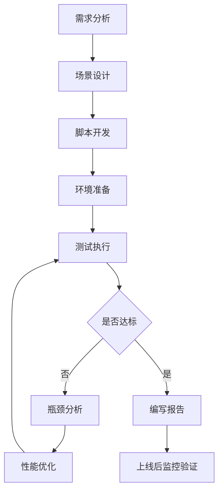

# 岗位职责

## 目录
- [一、测试工程师岗位职责（初级/中级/高级）](#一测试工程师岗位职责初级中级高级)
- [二、测试开发工程师岗位职责](#二测试开发工程师岗位职责)
- [三、性能测试工程师岗位职责](#三性能测试工程师岗位职责)
- [四、安全测试工程师岗位职责](#四安全测试工程师岗位职责)
- [五、测试负责人/测试经理岗位职责](#五测试负责人测试经理岗位职责)
- [六、测试架构师岗位职责](#六测试架构师岗位职责)
- [七、各岗位能力模型与晋升路径](#七各岗位能力模型与晋升路径)
- [八、岗位职责定义模板（可复用）](#八岗位职责定义模板可复用)

---

## 一、测试工程师岗位职责（初级/中级/高级）

### 1.1 初级测试工程师（T1，0-2年经验）

**岗位定位：** 在指导下完成功能测试执行，保障基础质量。

**核心职责：**

| 职责领域 | 具体内容 | 产出物 |
|---------|---------|-------|
| 用例执行 | 根据已有测试用例执行功能测试，准确记录测试结果 | 测试执行记录、测试日报 |
| Bug提交 | 发现缺陷后规范提交Bug，包含复现步骤、截图、日志等 | Bug报告（Jira/Tapd） |
| 用例编写 | 在指导下编写简单模块的功能测试用例 | 测试用例（Excel/Xmind） |
| 环境部署 | 按照文档搭建测试环境，执行基础的环境验证 | 环境部署记录 |
| 回归测试 | 执行回归测试用例，验证Bug修复情况 | 回归测试报告 |
| 文档维护 | 维护测试相关的基础文档，如操作手册、部署文档 | 操作手册 |

**能力要求：**
- 掌握软件测试基础理论（黑盒测试方法、测试流程）
- 熟练使用至少一种Bug管理工具（Jira、禅道、TAPD）
- 了解常用测试用例设计方法（等价类、边界值、判定表、正交实验）
- 具备基础的SQL查询能力（SELECT、JOIN、WHERE）
- 了解HTTP协议基础，能使用Postman进行接口调用
- 具备良好的沟通能力和责任心

**典型工作任务示例：**
```
任务：某电商App"商品搜索"功能迭代
1. 阅读需求文档，理解搜索功能的变化点
2. 参加测试用例评审，补充遗漏的测试场景
3. 执行预设的120条功能测试用例
4. 发现并提交15个Bug，其中3个P0级
5. 编写"搜索结果排序"模块的补充用例（20条）
6. 上线后执行线上回归冒烟测试（50条核心用例）
```

---

### 1.2 中级测试工程师（T2，2-5年经验）

**岗位定位：** 独立负责一个或多个模块的测试设计与执行，能主导小到中型需求的测试全流程。

**核心职责：**

| 职责领域 | 具体内容 | 产出物 |
|---------|---------|-------|
| 测试分析 | 独立进行需求分析，识别测试范围与风险点 | 需求分析文档、测试要点脑图 |
| 用例设计 | 独立设计功能测试用例，覆盖正常流程、异常流程、边界场景 | 完整测试用例集 |
| 测试计划 | 制定模块级测试计划，估算工作量与排期 | 测试计划 |
| 接口测试 | 使用Postman/JMeter编写接口测试用例，验证接口逻辑 | 接口测试用例、接口测试报告 |
| 测试报告 | 编写测试总结报告，包含质量评估与上线建议 | 测试总结报告 |
| 新人指导 | 指导初级测试工程师的工作，进行用例评审 | 新人指导记录 |
| 自动化入门 | 编写简单的UI或接口自动化脚本（Selenium/Requests） | 自动化脚本 |

**能力要求：**
- 精通测试用例设计方法（场景法、因果图、状态迁移、Pairwise）
- 熟练使用接口测试工具（Postman、JMeter、SoapUI）
- 具备较强的SQL能力（多表联查、子查询、存储过程）
- 掌握至少一种编程语言（Python/Java），能编写自动化脚本
- 了解性能测试基础知识（TPS、响应时间、并发数）
- 具备风险识别与评估能力
- 能独立与产品、开发沟通需求细节

**典型工作任务示例：**
```
任务：某支付系统"退款流程"重构
1. 参加需求评审3次，提出12个测试关注点
2. 输出"退款流程"需求分析与测试要点脑图
3. 设计功能测试用例180条（含正常/异常/边界）
4. 编写接口自动化测试脚本30条（Python + Requests）
5. 在联调阶段发现接口设计缺陷2个
6. 指导1名初级工程师执行部分用例
7. 编写测试总结报告，给出"建议上线，需关注监控指标X"的结论
```

---

### 1.3 高级测试工程师（T3，5-8年经验）

**岗位定位：** 负责复杂业务的整体测试把控，能主导大型项目测试，推动质量体系改进。

**核心职责：**

| 职责领域 | 具体内容 | 产出物 |
|---------|---------|-------|
| 测试策略 | 制定大型项目的全局测试策略，包含分层测试方案 | 测试策略文档 |
| 质量把控 | 全链路质量把控，建立质量度量体系 | 质量度量报告 |
| 自动化建设 | 搭建或主导自动化测试框架，推动自动化覆盖率提升 | 自动化框架、覆盖率报告 |
| 性能测试 | 独立完成性能测试方案设计与执行 | 性能测试方案、性能测试报告 |
| 技术攻关 | 解决测试过程中的技术难题（如复杂环境搭建、专项测试） | 技术方案文档 |
| 流程优化 | 发现测试流程中的瓶颈，推动流程优化 | 流程改进提案 |
| 团队赋能 | 技术分享、培训、辅导中初级工程师成长 | 培训材料、技术分享记录 |
| 质量分析 | 线上问题复盘，推动质量改进措施落地 | 线上问题分析报告 |

**能力要求：**
- 精通业务领域知识，能从业务视角思考质量
- 精通自动化测试框架设计（数据驱动、关键字驱动、POM模式）
- 精通性能测试工具链（JMeter/LoadRunner + 监控体系）
- 具备CI/CD流水线搭建能力（Jenkins/GitLab CI）
- 具备代码评审能力，能发现开发代码中的潜在问题
- 具备项目管理能力，能协调多方资源完成测试任务
- 具备技术影响力，能推动团队技术方向

**典型工作任务示例：**
```
任务：某电商平台"双11"大促保障
1. 制定"双11"全链路测试策略（功能+性能+稳定性+容灾）
2. 梳理核心交易链路TOP50场景，制定优先级矩阵
3. 主导性能压测：全链路压测方案、容量评估、瓶颈定位
4. 搭建"全链路压测平台"快速反馈机制
5. 推动开发侧补充单元测试覆盖率从30%提升至60%
6. 组织3轮全链路演练，发现并推动修复风险点12个
7. 大促期间值守，0重大线上事故
8. 编写大促保障复盘报告，沉淀为团队知识库
```

---

## 二、测试开发工程师岗位职责

### 2.1 岗位定位

测试开发工程师（SDET，Software Development Engineer in Test）是以代码开发为主要手段来解决测试效率和质量问题的技术岗位。核心区别在于：传统测试工程师以"手工测试"为主，测试开发工程师以"工具/平台/框架开发"为主。

### 2.2 初中高级职责对照

| 维度 | 初级测试开发（T1-T2） | 中级测试开发（T2-T3） | 高级测试开发（T3-T4） |
|-----|---------------------|---------------------|---------------------|
| **接口自动化** | 维护已有接口自动化用例 | 搭建接口自动化框架 | 设计分层自动化测试体系 |
| **UI自动化** | 编写简单的UI自动化脚本 | 封装Page Object + 数据驱动 | 设计跨平台UI自动化方案 |
| **测试工具** | 编写简单脚本工具（数据构造） | 开发中等复杂度测试工具 | 开发测试平台（Mock平台、造数平台） |
| **CI/CD** | 配置Jenkins Job | 搭建CI/CD流水线 | 设计多环境持续交付流水线 |
| **性能测试** | 执行已有性能脚本 | 编写性能测试脚本并分析结果 | 设计全链路压测方案 |
| **框架设计** | 使用现有框架 | 优化/扩展现有框架 | 从零设计测试框架 |
| **团队影响** | 个人贡献 | 指导1-2人 | 主导团队技术方向 |

### 2.3 核心职责详述

**测试框架开发与维护：**
- 设计统一的自动化测试框架，支持接口、UI、性能等多种测试类型
- 封装通用能力（数据驱动、报告生成、失败重试、并发执行）
- 框架持续优化，保持技术栈先进性

**测试工具与平台开发：**
- 测试数据构造平台：支持批量造数、数据脱敏、数据隔离
- Mock服务平台：支持HTTP/Dubbo/MQ等多种协议的Mock
- 测试管理平台：用例管理、执行调度、结果分析
- 质量度量平台：自动化收集和分析质量数据

**持续集成与持续交付：**
- 搭建和维护CI/CD流水线，实现自动化测试与构建集成
- 设计代码提交→静态扫描→单元测试→接口测试→UI测试→部署的自动化流水线
- 优化测试执行效率（并行化、分布式执行）

**技术能力要求：**
```
编程语言：精通至少一门（Java/Python/Go）
框架能力：Spring Boot / Flask / FastAPI
自动化工具：Selenium / Appium / Cypress / Playwright
CI/CD工具：Jenkins / GitLab CI / GitHub Actions
容器技术：Docker / Kubernetes
数据库：MySQL / Redis / MongoDB
中间件：Kafka / RabbitMQ / Nginx
```

---

## 三、性能测试工程师岗位职责

### 3.1 岗位定位

性能测试工程师专注系统的性能、稳定性、容量验证，负责发现性能瓶颈并推动优化。

### 3.2 核心职责

**性能测试方案设计：**
- 分析业务场景，确定性能测试目标和指标
- 设计性能测试场景（基准测试、负载测试、压力测试、稳定性测试、容量测试）
- 确定性能测试数据策略（数据量、数据分布、参数化）
- 制定性能测试通过标准

**性能测试执行：**
- 编写性能测试脚本（JMeter/Gatling/Locust）
- 搭建性能测试环境（与生产环境1:N配置）
- 执行性能测试并监控关键指标
- 瓶颈定位与根本原因分析

**性能监控与分析：**
- 搭建性能监控体系（服务器监控、应用监控、数据库监控）
- 分析性能指标：TPS、响应时间、错误率、资源利用率
- 结合APM工具（SkyWalking/Pinpoint/NewRelic）进行链路分析
- 编写性能测试报告，输出优化建议

**性能测试指标参考：**

| 指标类型 | 具体指标 | 说明 |
|---------|---------|-----|
| 吞吐量 | TPS/QPS | 每秒处理的事务/请求数 |
| 响应时间 | AVG/P95/P99/Max RT | 不同分位的响应时间 |
| 错误率 | Error% | 错误请求占总请求的比例 |
| 资源利用率 | CPU/Memory/Disk/Network | 服务器资源使用情况 |
| 并发能力 | Concurrent Users | 系统能承载的最大并发用户数 |

### 3.3 性能测试流程



---

## 四、安全测试工程师岗位职责

### 4.1 岗位定位

安全测试工程师负责发现系统中的安全漏洞，推动安全风险修复，建设安全测试体系。

### 4.2 核心职责

**安全测试执行：**
- Web安全测试：SQL注入、XSS、CSRF、SSRF、文件上传漏洞、越权漏洞
- API安全测试：接口鉴权、数据加密、防篡改、频率限制
- 移动端安全测试：反编译、数据存储安全、网络传输安全
- 安全配置核查：服务器配置、中间件配置、云服务安全配置

**安全工具使用与开发：**
- 熟练使用安全扫描工具：Burp Suite / OWASP ZAP / Nessus / AppScan
- 开发安全测试脚本，自动化安全扫描
- 搭建安全测试平台，集成到CI/CD流水线

**安全规范与审查：**
- 参与安全需求评审，输出安全测试方案
- 制定安全编码规范，推动安全左移
- 组织安全培训，提升团队安全意识

**OWASP Top 10 常见漏洞检查项：**

| 漏洞类型 | 测试方法 | 工具 |
|---------|---------|-----|
| SQL注入 | 输入特殊字符，检查是否报SQL错误 | SQLMap / Burp Suite |
| XSS跨站脚本 | 输入JS代码，检查是否被执行 | XSStrike / Burp Suite |
| 失效的认证 | 测试登录接口的暴力破解/会话管理 | Burp Suite Intruder |
| 敏感数据泄露 | 检查传输加密/存储加密情况 | Wireshark / 代码审查 |
| 越权访问 | 修改请求中的ID参数，验证权限控制 | Burp Suite |
| 安全配置错误 | 检查中间件/框架默认配置 | Nessus / OpenVAS |
| 反序列化漏洞 | 测试反序列化接口的安全性 | ysoserial |

---

## 五、测试负责人/测试经理岗位职责

### 5.1 岗位定位

测试负责人（Test Lead/Test Manager）是测试团队的领导者，负责测试团队的管理、项目测试交付、质量体系建设。

### 5.2 核心职责矩阵

| 职责维度 | 具体内容 | 关键产出 |
|---------|---------|---------|
| **项目交付** | 多项目测试资源协调、进度管控、风险识别与应对 | 项目测试计划、风险报告 |
| **团队管理** | 团队组建、绩效管理、人才培养、文化建设 | 团队OKR、绩效评估、培训计划 |
| **质量体系** | 质量流程建设、质量标准制定、质量度量监控 | 质量体系文档、质量月报 |
| **技术规划** | 测试技术路线规划、自动化建设推进、工具选型 | 技术规划文档、工具评估报告 |
| **沟通协调** | 跨部门沟通、向上汇报、对外协作 | 周报/月报、述职报告 |

### 5.3 日常工作内容

**每日工作：**
- 晨会：了解各项目测试进度，识别阻塞点
- 进度跟踪：检查测试任务完成情况，调整资源分配
- 风险管理：监控线上问题、测试阻塞、人员风险
- 沟通支持：解决团队成员遇到的问题

**每周工作：**
- 周会：回顾本周测试情况，规划下周工作
- 1对1沟通：与团队成员逐一沟通，了解状态和诉求
- 周报：输出测试团队周报，向上汇报
- 技术评审：参与重要项目的测试方案评审

**每月工作：**
- 质量月报：统计线上Bug数、测试效率、自动化覆盖率等指标
- 绩效考核：对团队成员进行月度/季度绩效评估
- 团队建设：组织技术分享、团建活动
- 规划回顾：检查OKR执行情况，调整下月计划

### 5.4 能力模型

| 能力项 | 初级测试经理 | 资深测试经理 |
|-------|------------|------------|
| 管理规模 | 5-10人团队 | 15-30人团队 |
| 项目复杂度 | 单一产品线 | 多条产品线并行 |
| 技术深度 | 了解主流测试技术 | 深度理解技术方案，能做技术决策 |
| 业务理解 | 熟悉负责业务线 | 理解公司商业逻辑 |
| 向上管理 | 执行上级安排 | 主动影响决策，争取资源 |
| 团队建设 | 维持团队稳定 | 构建有战斗力的团队文化 |

---

## 六、测试架构师岗位职责

### 6.1 岗位定位

测试架构师是测试团队中技术级别最高的岗位，负责制定测试技术战略、搭建测试基础设施、解决全局性技术难题。

### 6.2 核心职责

**测试技术战略规划：**
- 制定3-5年测试技术路线图
- 评估新技术趋势对测试的赋能（AI测试、混沌工程、流量回放）
- 制定测试技术规范与标准

**测试基础设施搭建：**
- 设计测试平台的整体架构
- 测试环境管理方案（环境隔离、环境复用、环境即服务）
- 测试数据管理方案（数据脱敏、数据隔离、数据快照）

**全局技术攻关：**
- 解决跨团队、跨系统的复杂测试技术问题
- 极端场景测试方案设计（全链路压测、故障演练、数据一致性验证）
- 测试效能提升（执行时间优化、环境利用率提升）

**技术影响力建设：**
- 内部技术分享与培训（高级主题）
- 外部技术输出（技术博客、行业会议、开源贡献）
- 技术评审把关（架构设计评审、代码评审）

### 6.3 测试架构师与其他角色的区别

| 维度 | 高级测试开发 | 测试经理 | 测试架构师 |
|-----|------------|---------|----------|
| 关注点 | 具体技术实现 | 团队与项目交付 | 全局技术战略 |
| 时间线 | 周/月 | 月/季度 | 季度/年 |
| 影响范围 | 单个项目/平台 | 单个团队 | 整个部门/公司 |
| 核心产出 | 代码/工具 | 团队产出/质量指标 | 技术方案/架构设计 |

---

## 七、各岗位能力模型与晋升路径

### 7.1 测试岗位职级体系总览

> **说明：** 本文使用的 T/P/M 职级体系（T=技术入门级, P=专业技术级, M=管理级）是互联网/科技行业的 HR 惯例，用于企业内部定级、薪酬和晋升管理。它与 ISTQB 认证等级（基础级/高级/专家级）是两个独立体系——前者侧重企业组织管理，后者侧重个人专业认证。两者可互补但不可混为一谈。

```
技术序列（Tech Track）              管理序列（Management Track）
========================            ============================
P4 资深测试架构师                      M4 测试总监
P3 测试架构师                          M3 高级测试经理
P2 高级测试开发/高级测试工程师           M2 测试经理
P1 中级测试开发/中级测试工程师           M1 测试组长
T2 初级测试开发/初级测试工程师
T1 助理测试工程师
```

### 7.2 各职级能力模型

| 职级 | 工作经验 | 核心能力 | 典型产出 |
|-----|---------|---------|---------|
| T1 助理 | 0-1年 | 执行测试用例、提交Bug | 按质按量完成分配的测试任务 |
| T2 初级 | 1-2年 | 独立设计用例、接口测试 | 独立负责一个小模块的测试 |
| P1 中级 | 2-5年 | 主导测试方案、自动化框架使用 | 独立负责核心模块测试，指导新人 |
| P2 高级 | 5-8年 | 测试策略设计、自动化框架搭建 | 主导大型项目测试，团队技术中坚 |
| P3 架构师 | 8-12年 | 测试技术战略、跨系统方案设计 | 测试平台架构设计，技术影响力 |
| P4 资深架构师 | 12年+ | 行业影响力、全局技术领导 | 公司级测试技术战略 |

### 7.3 晋升通道设计

**晋升评估维度：**

| 评估维度 | 权重 | 评估标准 |
|---------|-----|---------|
| 技术能力 | 35% | 测试技术深度、工具/框架开发能力、解决复杂问题能力 |
| 业务贡献 | 30% | 项目质量保障效果、线上质量数据、效率提升贡献 |
| 团队贡献 | 20% | 新人培养、技术分享、知识沉淀、流程优化 |
| 影响力 | 15% | 跨团队协作、向上影响力、外部技术输出 |

**晋升流程：**
```
1. 提名：Leader提名或自荐
2. 材料准备：晋升述职PPT + 代表作材料
3. 技术评审：技术委员会coding/design review
4. 晋升答辩：向晋升委员会述职（30min陈述 + 30min Q&A）
5. 结果公示：晋升结果全公司公示
```

### 7.4 能力雷达图示例

**高级测试工程师能力雷达图：**
```
        业务理解
          /|\
         / | \
        /  |  \
代码能力  |   沟通协调
        \  |  /
         \ | /
          \|/
        质量思维
```

---

## 八、岗位职责定义模板（可复用）

### 8.1 岗位JD模板

```markdown
# 【岗位名称】XXX测试工程师

## 岗位基本信息
- **岗位名称：** XXX测试工程师
- **所属部门：** 质量保障部 / XXX业务线
- **汇报对象：** 测试经理
- **岗位级别：** P1-P3（依据面试定级）
- **薪资范围：** XXK-XXK * 15薪
- **工作地点：** XXX

## 岗位职责
1. 负责XXX产品线/项目的功能测试、接口测试
2. 参与需求评审，输出测试分析和测试用例
3. 使用自动化测试工具提升回归测试效率
4. 跟踪缺陷生命周期，推动问题解决
5. 编写测试报告，评估版本质量

## 任职要求
### 必备条件
- 本科及以上学历，计算机相关专业
- X年以上软件测试经验
- 熟练掌握测试用例设计方法
- 熟练使用SQL进行数据验证
- 熟悉至少一种编程语言（Python/Java）

### 加分项
- 有自动化测试框架搭建经验
- 有性能测试实践经验
- 有金融/电商/游戏等行业经验
- 熟悉CI/CD流水线配置

## 我们提供
- 有竞争力的薪资与期权
- 双休、五险一金、补充商业保险
- 技术氛围浓厚，定期技术分享
- 清晰的晋升通道与培养体系
```

### 8.2 岗位职责文档模板（内部使用）

```markdown
# 【内部】XXX岗位职责说明书

## 一、岗位定位
简要描述该岗位在组织中的角色和价值

## 二、组织关系
- **直接上级：** XXX
- **直接下级：** XXX（如无则写"无"）
- **内部协作：** 产品部、开发部、运维部
- **外部协作：** 无

## 三、核心职责（权重合计100%）
| 职责 | 权重 | 期望产出 |
|-----|-----|---------|
| 职责1 | 30% | 产出物描述 |
| 职责2 | 25% | 产出物描述 |
| 职责3 | 20% | 产出物描述 |
| 职责4 | 15% | 产出物描述 |
| 职责5 | 10% | 产出物描述 |

## 四、关键绩效指标（KPI）
| 指标 | 目标值 | 衡量方式 |
|-----|-------|---------|
| 测试用例覆盖率 | ≥95% | 用例数/需求功能点数 |
| 线上逃逸Bug数 | ≤2个/月 | Jira线上Bug统计 |
| 自动化覆盖率 | ≥60% | 自动化用例数/总回归用例数 |
| 测试按时完成率 | ≥90% | 按时完成项目数/总项目数 |

## 五、任职资格
### 教育背景
- 学历要求
- 专业要求

### 工作经验
- 年限要求
- 行业经验

### 技术能力
| 能力项 | 要求级别 | 说明 |
|-------|---------|-----|
| 能力A | 精通 | 能指导和评审他人工作 |
| 能力B | 熟练 | 能独立完成工作 |
| 能力C | 了解 | 知道基本概念和应用场景 |

### 软技能
- 沟通能力：能清晰表达观点，与多方有效沟通
- 学习能力：能快速学习新技术并应用到工作
- 责任心：对交付质量有高要求
```

### 8.3 岗位职责检查清单

团队管理者在定义新岗位时，请逐项检查：

- [ ] 岗位定位是否清晰（解决了什么业务问题）
- [ ] 与现有岗位职责是否有重叠或冲突
- [ ] 职责描述是否可衡量（避免模糊词汇如"负责质量"）
- [ ] 任职要求是否合理（无过度要求或歧视性条款）
- [ ] 晋升路径是否明确（横向和纵向发展通道）
- [ ] 薪酬是否对标市场水平
- [ ] 岗位JD是否经过HR评审
- [ ] 是否设置了试用期考核标准

---

## 附录：各岗位面试评估要点

| 岗位 | 技术面重点 | 软技能重点 |
|-----|----------|----------|
| 初级测试 | 测试理论、用例设计、SQL基础 | 学习能力、责任心、沟通表达 |
| 中级测试 | 接口测试、自动化基础、业务理解 | 问题分析、团队协作、主动性 |
| 高级测试 | 测试策略、框架设计、性能分析 | 技术影响力、项目推动、人才培养 |
| 测试开发 | 算法与数据结构、系统设计、框架原理 | 代码规范、技术视野、协作能力 |
| 性能测试 | 性能模型、JVM调优、监控体系 | 逻辑分析、耐心细致、报告能力 |
| 安全测试 | OWASP知识、漏洞原理、工具使用 | 好奇心、道德底线、严谨性 |
| 测试经理 | 项目管控、质量体系、绩效管理 | 领导力、向上管理、冲突解决 |
| 测试架构师 | 架构设计、技术前瞻、多技术栈 | 技术愿景、跨组织影响力、决策力 |

---

> 本文最后更新时间：2026年6月
> 维护者：测试团队管理建设体系编写组
