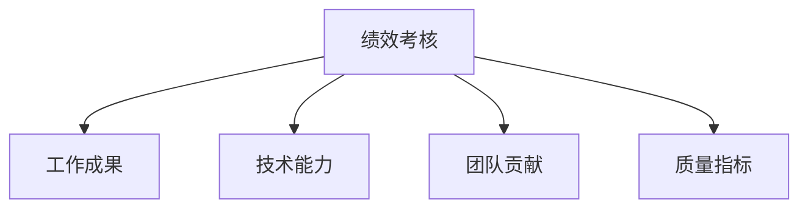

# 02 绩效考核

## 目录
- [一、测试团队绩效考核体系设计](#一测试团队绩效考核体系设计)
- [二、OKR vs KPI 在测试团队的应用](#二okr-vs-kpi-在测试团队的应用)
- [三、绩效考核维度](#三绩效考核维度)
- [四、考核周期与流程](#四考核周期与流程)
- [五、考核结果应用](#五考核结果应用)
- [六、避免考核中的常见误区](#六避免考核中的常见误区)
- [七、5个绩效考核方案案例](#七5个绩效考核方案案例)

---

## 一、测试团队绩效考核体系设计

### 1.1 考核体系设计原则

测试团队绩效考核的设计必须遵循以下核心原则，否则考核会适得其反：

| 原则 | 说明 | 反例 |
|-----|-----|-----|
| **结果导向** | 考核产出而非过程，考核质量而非数量 | 单纯按Bug提交数量考核 |
| **可衡量性** | 指标必须可量化或可定性评估 | "工作态度好"这种模糊评价 |
| **公平公正** | 考核标准统一透明，避免主观偏见 | 不同Leader打分标准差异大 |
| **正向激励** | 考核目的是激励改进，而非惩罚 | 公开批评排名靠后的成员 |
| **持续反馈** | 考核不是一次性事件，而是持续过程 | 只在年终做一次绩效面谈 |
| **业务对齐** | 考核指标与团队目标、业务目标对齐 | 考核自动化覆盖率但业务线不需要自动化 |

### 1.2 考核体系的四个层次

```
第一层：公司战略目标
    ↓ 拆解
第二层：部门/团队目标（团队OKR）
    ↓ 拆解
第三层：个人目标（个人OKR/KPI）
    ↓ 评估
第四层：个人绩效结果
```

### 1.3 考核体系设计步骤

**Step 1 — 明确考核目的：**
- 评估个人贡献，为晋升/调薪提供依据
- 发现能力短板，制定个人发展计划
- 激励高效能员工，识别低效员工
- 验证团队目标是否达成

**Step 2 — 确定考核维度与权重：**
- 工作成果（60-70%）：项目交付、质量指标、效率指标
- 技术能力（15-20%）：技术提升、工具建设、技术输出
- 团队贡献（10-15%）：新人辅导、知识分享、流程改进

**Step 3 — 设计评分标准：**
- S级（卓越，110%+）：超出预期，具有突破性贡献
- A级（优秀，100-109%）：完全达标，部分超出预期
- B级（良好，85-99%）：基本达标，按质按量完成
- C级（待改进，70-84%）：部分未达标，需要改进
- D级（不合格，<70%）：严重未达标，需重点关注

**Step 4 — 建立数据收集机制：**
- 自动化数据采集（Jira API、GitLab API、自动化平台API）
- 定期数据回顾（月度/季度）
- 多方反馈收集（360度评估）

**Step 5 — 设定反馈与申诉机制：**
- 绩效面谈制度（每季度至少1次正式面谈）
- 绩效结果确认签字
- 申诉通道（向HR或上级的上级申诉）

---

## 二、OKR vs KPI 在测试团队的应用

### 2.1 OKR与KPI对比

| 维度 | OKR | KPI |
|-----|-----|-----|
| 核心理念 | 目标管理工具，驱动挑战与创新 | 绩效考核工具，衡量关键指标 |
| 设定方式 | 自下而上 + 自上而下结合 | 多为自上而下分解 |
| 目标难度 | 鼓励挑战性目标（完成70%算成功） | 通常是可达成的目标（100%达标） |
| 与绩效关系 | 不完全与薪资挂钩 | 直接与薪资/奖金挂钩 |
| 适用场景 | 创新业务、快速变化的环境 | 成熟业务、稳定的运营环境 |
| 透明度 | 全员公开透明 | 部分公开或保密 |

### 2.2 测试团队OKR设计示例

**公司级目标：** 提升产品发布质量，降低线上事故率

**测试团队季度OKR：**

```markdown
## 目标O1：提升核心业务线的回归测试效率

KR1.1：核心接口自动化覆盖率从45%提升至70%
KR1.2：自动化回归测试执行时间从4小时缩短至1小时内
KR1.3：实现30个核心场景的UI自动化，减少手工回归工作量50%

## 目标O2：建设完善的线上质量监控体系

KR2.1：上线后72小时内线上Bug发现数 < 2个
KR2.2：建立10个核心业务指标的质量看板
KR2.3：实现关键接口的线上拨测，覆盖所有P0级接口

## 目标O3：提升测试团队技术能力

KR3.1：团队全员通过Python编程基础考核（80分以上）
KR3.2：每位高级工程师至少完成1次团队级技术分享
KR3.3：测试工具平台累计减少手工测试工作量200人天
```

### 2.3 测试团队KPI设计示例

```markdown
## 项目交付相关KPI（权重40%）
- KPI1：测试用例覆盖率 ≥ 95%
- KPI2：阻塞级Bug（P0）零逃逸至生产环境
- KPI3：测试任务按时完成率 ≥ 90%
- KPI4：版本回归测试一次通过率 ≥ 85%

## 质量指标KPI（权重30%）
- KPI5：线上有效Bug数 ≤ 3个/月
- KPI6：线上故障中测试遗漏占比 < 10%
- KPI7：需求评审中发现的逻辑缺陷数 ≥ 5个/版本

## 技术能力KPI（权重20%）
- KPI8：自动化测试用例新增 ≥ X条/季度（根据职级）
- KPI9：测试工具脚本开发 ≥ X个/季度

## 团队贡献KPI（权重10%）
- KPI10：技术分享 ≥ 1次/季度
- KPI11：新人辅导（导师制完成度100%）
```

### 2.4 OKR与KPI的组合策略

**推荐实践：OKR + KPI 双轨制**

| 场景 | 使用OKR | 使用KPI |
|-----|--------|--------|
| 年度目标设定 | ✓ 战略目标 | - |
| 季度目标设定 | ✓ 战术目标 | - |
| 月度考核 | - | ✓ 过程指标 |
| 晋升评估 | ✓ 挑战性成果 | ✓ 稳定性指标 |
| 年终奖金 | ✓ 目标达成 | ✓ 关键指标达标 |

---

## 三、绩效考核维度

### 3.1 四维考核模型



### 3.2 工作成果维度（权重55%）

| 考核指标 | 数据来源 | 评分标准 |
|---------|---------|---------|
| 项目交付质量 | 项目复盘报告 | S:零线上事故 | A:≤1个小问题 | B:≤3个小问题 | C:有中等事故 |
| 测试任务完成率 | Jira/禅道统计 | S:100% | A:≥95% | B:≥85% | C:<85% |
| 缺陷发现效率 | Bug系统统计 | S:发现大量深层Bug | A:发现关键Bug | B:正常水平 | C:漏测较多 |
| 测试进度把控 | 项目排期对比 | S:提前完成 | A:按时完成 | B:延迟<20% | C:延迟≥20% |

### 3.3 技术能力维度（权重20%）

| 考核指标 | 数据来源 | 评分标准 |
|---------|---------|---------|
| 自动化建设 | Git代码提交记录 | S:独立搭建框架 | A:编写核心脚本 | B:维护已有脚本 | C:无自动化贡献 |
| 技术深度 | 技术评审/Coding Review | S:评审开发代码发现关键问题 | A:独立解决技术难题 | B:能处理常规问题 | C:需要大量指导 |
| 工具开发 | 工具使用数据 | S:开发团队级工具 | A:开发个人工具 | B:利用现有工具 | C:无工具开发 |
| 技术学习 | 学习笔记/证书/分享 | S:考取权威认证 | A:系统学习新技术 | B:碎片化学习 | C:无学习行为 |

### 3.4 团队贡献维度（权重15%）

| 考核指标 | 数据来源 | 评分标准 |
|---------|---------|---------|
| 新人辅导 | 新人成长评估 | S:辅导的新人快速成长 | A:完成导师职责 | B:部分完成 | C:未参与辅导 |
| 知识分享 | 分享会记录 | S:季度≥3次高质量分享 | A:≥1次分享 | B:参与讨论 | C:从不分享 |
| 文档沉淀 | Wiki/Confluence | S:输出团队级文档≥3篇 | A:输出≥1篇 | B:维护已有文档 | C:无文档贡献 |
| 流程优化 | 改进提案记录 | S:提案被采纳并产生效果 | A:提出有价值的建议 | B:参与流程讨论 | C:不参与 |

### 3.5 质量指标维度（权重10%）

| 考核指标 | 数据来源 | 评分标准 |
|---------|---------|---------|
| 线上逃逸Bug | 线上Bug统计 | S:0逃逸 | A:≤1 | B:≤3 | C:>3 |
| 测试用例有效性 | Bug与用例关联分析 | S:用例发现率≥85% | A:≥70% | B:≥50% | C:<50% |
| 代码质量 | SonarQube/代码扫描 | S:代码扫描0告警 | A:告警<5 | B:告警<15 | C:告警≥15 |

---

## 四、考核周期与流程

### 4.1 考核周期设计

```
年度考核（Yearly Review）
    │
    ├── Q1季度考核（目标设定 + 执行 + 结果评估）
    │       ├── 月度1on1沟通（目标进度检视）
    │       ├── 月度1on1沟通
    │       └── 月度1on1沟通
    │
    ├── Q2季度考核（年中Review，可做晋升提名）
    │
    ├── Q3季度考核
    │
    └── Q4季度考核（年终Review，晋升/调薪/奖金）
```

| 考核节奏 | 目的 | 主要内容 |
|---------|-----|---------|
| 月度1on1 | 过程跟踪 | 进度检视、问题辅导、目标微调 |
| 季度考核 | 阶段性评价 | 季度目标达成评估、绩效面谈 |
| 年中Review | 中期回顾 | 上半年总结、下半年规划、晋升提名 |
| 年终Review | 年度总评 | 全年绩效评估、晋升答辩、薪资调整 |

### 4.2 考核流程

**标准考核流程（以季度考核为例）：**

```
第1周：启动
├── HR发布考核通知
├── Leader制定团队目标
└── 个人制定季度目标

第2周：目标设定
├── 1on1沟通确认个人目标
├── 目标录入系统（OKR/KPI系统）
└── 上下级对齐确认

第3-11周：执行跟踪
├── 月度1on1（进度检视）
├── 数据自动采集（Jira/GitLab等）
├── 日常反馈与辅导
└── 目标中期调整（如需要）

第12周：评估
├── 个人自评（提交自评报告）
├── Leader评估（打分+评语）
├── 数据核实（HR/QA核实数据准确性）

第13周：面谈
├── 绩效面谈（Leader与个人）
├── 确认结果（双方签字）
├── 上诉期（3个工作日）

第14周：结果应用
├── 绩效结果审批（HR+管理层）
├── 奖金/调薪/晋升
└── 下季度目标设定
```

### 4.3 月度1on1沟通模板

```markdown
# 月度1on1沟通记录

**沟通日期：** YYYY-MM-DD
**沟通对象：** XXX
**沟通人：** XXX（Leader）

## 一、本月工作总结
- 完成的主要工作：
  1. 
  2. 
- 目标达成情况：目标A完成X%，目标B完成Y%

## 二、亮点与成长
- 做得好的地方：
- 能力提升表现：

## 三、待改进点
- 需要改进的地方：
- 改进建议：

## 四、遇到的问题与支持
- 当前遇到的困难：
- 需要的支持：

## 五、下月工作重点
1. 
2. 

## 六、个人发展
- 学习计划进展：
- 技能提升方向：

## 七、其他
- 个人诉求与建议：
```

---

## 五、考核结果应用

### 5.1 薪酬调整

| 绩效等级 | 调薪幅度 | 年终奖系数 | 说明 |
|---------|---------|----------|-----|
| S级（卓越） | 15-25% | 1.5-2.0x | 核心骨干，必须保留 |
| A级（优秀） | 8-15% | 1.2-1.5x | 高绩效员工 |
| B级（良好） | 3-8% | 1.0-1.2x | 稳定贡献者 |
| C级（待改进） | 0-3% | 0.5-0.8x | 需制定改进计划 |
| D级（不合格） | 0% | 0x | 可能进入PIP或优化 |

### 5.2 晋升通道

```
连续两次获得A级及以上 → 进入晋升提名池
    ↓
晋升答辩 → 通过 → 职级晋升 + 薪资调整
    ↓
未通过 → 获得反馈 → 针对性提升 → 下一年再战
```

### 5.3 培训发展

| 绩效等级 | 培训资源倾斜 |
|---------|------------|
| S级 | 外部高阶培训、行业大会、MBA/EMBA赞助 |
| A级 | 外部技术培训、行业大会 |
| B级 | 内部培训、在线课程报销 |
| C级 | 制定PIP（绩效改进计划），针对性辅导 |

### 5.4 绩效改进计划模板（PIP）

```markdown
# 绩效改进计划（PIP）

**员工姓名：** XXX
**当前绩效等级：** C级
**计划周期：** YYYY-MM-DD 至 YYYY-MM-DD（通常60-90天）

## 一、待改进领域
1. 问题描述：具体什么问题
2. 影响：对团队/项目的影响
3. 目标状态：达到什么标准

## 二、改进目标（SMART原则）
| 改进项目 | 目标 | 衡量标准 | 截止日期 |
|---------|-----|---------|---------|
| 项目A | 目标描述 | 可衡量标准 | 日期 |
| 项目B | 目标描述 | 可衡量标准 | 日期 |

## 三、支持计划
- Leader提供的辅导支持：
- 培训资源：
- 导师支持：

## 四、检查节点
| 检查日期 | 预期进度 | 实际进度 | 备注 |
|---------|---------|---------|-----|
| 第30天 | 进度A | | |
| 第60天 | 进度B | | |
| 第90天 | 进度C | | |

## 五、结果处理
- 全部达标：PIP关闭，恢复正常考核
- 部分达标：延长PIP 30天
- 严重未达标：进入优化流程

**员工签字：** __________ **日期：** __________
**Leader签字：** __________ **日期：** __________
**HR签字：** __________ **日期：** __________
```

---

## 六、避免考核中的常见误区

### 6.1 十二大常见误区

**误区1：单纯按Bug数量考核测试工程师**

这是测试绩效考核中最大的坑。Bug数量受模块复杂度、开发质量、测试阶段等多因素影响，不能简单对比。

```
正确做法：
- 考核Bug质量（发现深层/复杂Bug的加分）
- 考核Bug描述质量（步骤清晰、定位准确）
- 结合线上逃逸Bug反推测试质量
- Bug数量作为辅助参考，不作为主要考核指标
```

**误区2：考核指标过多过杂**

设定20+个KPI，导致员工无所适从，什么都要关注，什么都没做好。

```
正确做法：聚焦3-5个核心KPI + 2-3个OKR目标
```

**误区3：只看结果不看过程**

测试工作中很多"过程性工作"是无法通过最终结果体现的，比如测试环境维护、测试数据准备、文档编写等。

```
正确做法：结果指标占60-70%，过程性工作通过定性评价补充
```

**误区4：考核标准不透明**

每个Leader对评分标准的理解不一致，导致跨团队对比不公平。

```
正确做法：
- 制定统一的评分细则和案例
- 定期组织"定标会"对齐评分标准
- 引入跨级审批机制
```

**误区5：没有区分岗位差异**

用同一套标准考核功能测试工程师和测试开发工程师。

```
正确做法：根据岗位职责设定差异化考核权重
```

**误区6：只有在考核时才做沟通**

平时不做反馈，考核时才把问题"算总账"。

```
正确做法：建立日常反馈机制（月度1on1、项目复盘即时反馈）
```

**误区7：过于追求量化指标**

有些工作无法量化但很重要（如风险预警、技术攻关），强迫量化会导致扭曲行为。

```
正确做法：关键成果用OKR描述 + 360度定性评价补充
```

**误区8：忽视团队协作的考核**

只考核个人产出，忽视跨团队协作、帮助他人的贡献。

```
正确做法：团队贡献维度必须占一定权重（10-15%）
```

**误区9：滥用强制分布**

不管团队整体绩效如何，强行按比例分配S/A/B/C/D等级。

```
正确做法：
- 团队整体绩效好时，可以整体绩效系数上浮
- 团队整体绩效差时，S/A比例相应下调
- 小团队（<5人）不做强制分布
```

**误区10：考核结果不与员工发展挂钩**

考核做完了，但绩效好的人得不到发展机会，绩效差的人没有改进计划。

```
正确做法：考核结果必须与晋升、调薪、培训资源分配强关联
```

**误区11：忽视自评环节**

直接由Leader打分，不让员工自评，导致员工缺乏自我认知。

```
正确做法：先让员工自评，Leader结合自评进行校准和面谈
```

**误区12：用加班时长考核工作态度**

将加班时长作为努力程度的指标，严重损害团队健康。

```
正确做法：考核产出而非投入时间，鼓励高效工作
```

---

## 七、5个绩效考核方案案例

### 案例1：初创公司测试团队（10人以下）

**特点：** 业务变化快，人手紧张，一人多岗

```markdown
## 考核周期：季度考核 + 年度总评

## 考核模型：OKR（70%）+ 360度评价（30%）

## OKR设计原则：
- 每个季度设定3个O，每个O下2-3个KR
- OKR评分0-1.0分（0.7分即为良好）
- 不强制分布，根据OKR得分 + 360评价综合定级

## 季度考核流程：
1. 季度初：个人设定OKR，Leader对齐
2. 月度：1on1沟通进度
3. 季度末：OKR自评 + Leader评估 + 同事互评
4. 绩效结果与季度奖金挂钩

## 绩效等级：
- S（卓越，综合≥0.9）：季度奖金×2
- A（优秀，综合≥0.8）：季度奖金×1.5
- B（良好，综合≥0.7）：季度奖金×1.0
- C（待改进，综合<0.7）：季度奖金×0.5，制定改进计划
```

### 案例2：中型互联网公司测试团队（30-50人）

**特点：** 业务线多条，测试类型多样化，需要分层考核

```markdown
## 考核模型：KPI（50%）+ OKR（30%）+ 关键事件（20%）

## 功能测试工程师KPI（示例）：
| KPI指标 | 权重 | 目标值 |
|---------|-----|-------|
| 测试用例覆盖率 | 15% | ≥95% |
| 测试按时完成率 | 15% | ≥90% |
| 线上严重Bug逃逸数 | 15% | ≤1个/月 |
| 自动化用例新增数 | 10% | ≥20条/月 |
| 需求评审发现缺陷数 | 5% | ≥3个/版本 |

## OKR（季度）：
- O1：提升测试效率
  - KR1.1：核心模块自动化回归覆盖率提升至80%
  - KR1.2：平均回归测试执行时间缩短30%

## 关键事件（加减分项）：
- 加分：发现重大Bug避免线上事故（+0.1-0.3）
- 加分：主动优化流程带来可量化收益（+0.1-0.2）
- 减分：因测试遗漏导致线上事故（-0.1-0.5）

## 绩效等级与强制分布：
- S级：前10%
- A级：前20-30%
- B级：中间50-60%
- C/D级：后5-10%
```

### 案例3：金融科技公司测试团队

**特点：** 质量要求极高，合规要求严格，上线节奏慢

```markdown
## 考核模型：质量指标（50%）+ 合规指标（20%）+ 效率指标（20%）+ 团队贡献（10%）

## 质量指标（50%）：
| 指标 | 目标 |
|-----|-----|
| 生产事故中测试遗漏率 | 0% |
| 核心交易链路测试覆盖率 | 100% |
| 资金相关场景用例评审通过率 | 100% |
| 高危缺陷修复验证不通过率 | 0% |

## 合规指标（20%）：
| 指标 | 目标 |
|-----|-----|
| 测试文档归档完整率 | 100% |
| 监管审计要求测试项检查 | 100%通过 |
| 数据安全测试执行率 | 100% |

## 效率指标（20%）：
| 指标 | 目标 |
|-----|-----|
| 自动化回归覆盖率 | ≥80% |
| 测试执行效率（人天/功能点） | 逐年优化10% |

## 特殊考核规则：
- 发生资金类线上事故，季度绩效最高为B
- 发生重大监管合规问题，年度绩效最高为C
- 主动发现资金安全类高危Bug，直接触发绩效加分
```

### 案例4：测试开发工程师专用考核方案

```markdown
## 考核模型：平台建设（40%）+ 效能提升（30%）+ 技术支持（20%）+ 技术影响力（10%）

## 平台建设（40%）：
| 指标 | 说明 |
|-----|-----|
| 平台/工具开发完成度 | 按里程碑验收，功能可用性≥95% |
| 平台稳定性 | 平台可用率≥99.5% |
| 平台采纳率 | 目标用户中使用率≥80% |

## 效能提升（30%）：
| 指标 | 说明 |
|-----|-----|
| 自动化覆盖率提升 | 推动整体自动化覆盖率提升X% |
| 测试效率提升 | 通过工具/平台减少手工测试X人天/月 |
| CI/CD流水线效率 | 流水线执行时间缩短X%

## 技术支持（20%）：
| 指标 | 说明 |
|-----|-----|
| 工具/框架使用培训 | 每季度≥2次培训 |
| 技术问题响应 | 技术支持响应时间<4小时 |
| 用户满意度 | 平台/工具用户满意度≥4.5/5 |

## 技术影响力（10%）：
| 指标 | 说明 |
|-----|-----|
| 技术分享 | 每季度≥1次团队级分享 |
| 开源贡献 | 鼓励开源项目贡献 |
| 技术文章 | 鼓励输出技术博客 |
```

### 案例5：测试经理专用考核方案

```markdown
## 考核模型：团队产出（40%）+ 质量结果（30%）+ 团队建设（20%）+ 个人贡献（10%）

## 团队产出（40%）：
| 指标 | 说明 |
|-----|-----|
| 项目交付率 | 团队负责项目按时交付率≥90% |
| 测试任务完成率 | 团队任务按时完成率≥85% |
| 资源利用率 | 团队整体负载率在70-85%健康区间 |

## 质量结果（30%）：
| 指标 | 说明 |
|-----|-----|
| 线上严重Bug数 | 团队负责产品线月度严重Bug≤X |
| 生产事故测试遗漏率 | 年度≤X起 |
| 质量体系建设 | 质量流程文档完整度100% |

## 团队建设（20%）：
| 指标 | 说明 |
|-----|-----|
| 团队稳定性 | 核心成员离职率<15% |
| 人才梯队 | 各职级人员比例合理 |
| 培训体系 | 新人90天转正通过率≥85% |
| 团队满意度 | 团队满意度调查≥4.0/5 |

## 个人贡献（10%）：
| 指标 | 说明 |
|-----|-----|
| 跨部门协作评价 | 合作方满意度 |
| 向上管理 | 主动汇报、争取资源 |
| 技术判断力 | 重要技术决策准确度 |
```

---

## 附录：绩效考核工具推荐

| 工具 | 适用规模 | 特点 |
|-----|---------|-----|
| 飞书OKR | 全员 | 与飞书办公套件集成，OKR对齐可视化 |
| 钉钉绩效 | 全员 | 与钉钉OA集成，支持自定义考核模板 |
| 北森 | 中大型 | 专业HR SaaS，支持复杂绩效考核场景 |
| Moka | 中小型 | 轻量级，适合互联网公司 |
| 自研系统 | 大型 | 高度定制化，数据整合能力强 |

---

> 本文最后更新时间：2026年6月
> 维护者：测试团队管理建设体系编写组
